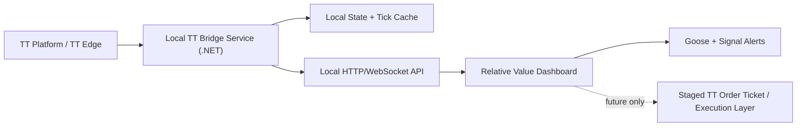

# RVEX Chat Record - 2026-05-29

This file captures the work and design decisions from the Codex chat so the Relative Value / RVEX project is not lost.

## Project Location

- Current project folder: `C:\Users\tstur\Documents\Codex\2026-05-29\retrieve-my-relative-value-project`
- Dashboard app: `relative-value-spread-dashboard.html`
- Local server: `dashboard-server.js`
- Cache: `futures-history-cache.json`
- Local URL: `http://127.0.0.1:8788/`

## Retrieved Project

The relative value dashboard was found in:

`C:\Users\tstur\Documents\Codex\2026-05-28\i-want-to-use-trading-technologies`

It was copied into the current project folder and started locally on port `8788`.

## Dashboard Features Added

The dashboard was upgraded with:

- Saved workspace/settings using browser `localStorage`.
- Saved manual prices, alert preferences, hidden/collapsed panels, and panel order.
- Macro summary pill typography fix so long text wraps/scales instead of overflowing.
- Dynamic repricing study for each spread.
- Repricing columns: current, fair value, buy trigger, sell trigger, distance, stop zone, score, and action.
- Goose decision engine upgrade using spread location, macro regime, volume, leadership, and headline keyword bias.
- Alerting system with configurable threshold, confidence filter, visual alert banner, alert log, and optional browser notifications.

Verification performed:

- Inline JavaScript syntax check passed.
- Local server returned HTTP 200.
- New settings and repricing panels were present.
- `/api/futures-history` returned ES, NQ, YM, RTY plus macro data.
- `/api/live-quotes` returned ES, NQ, YM, RTY, VIX, TNX, HYG, KRE, RSP, SPY.

## Local Launch Setup

Created launch files:

- `Start-Relative-Value-Dashboard.ps1`
- `Relative Value Dashboard.cmd`
- `Relative Value Dashboard.url`

Created shortcuts:

- Desktop app shortcut: `C:\Users\tstur\OneDrive\Desktop\Relative Value Dashboard.lnk`
- Desktop URL-only shortcut: `C:\Users\tstur\OneDrive\Desktop\Relative Value Dashboard Local Link.url`
- Start Menu shortcut: `C:\Users\tstur\AppData\Roaming\Microsoft\Windows\Start Menu\Programs\Relative Value Dashboard.lnk`

The app shortcut starts the local server if needed, then opens:

`http://127.0.0.1:8788/`

To pin to taskbar: right-click the Desktop shortcut or Start Menu item and choose `Pin to taskbar`.

## TT API Migration Blueprint

Design-only. No TT integration was implemented.

Recommended architecture:

### Recommended TT Path

- Use TT .NET SDK for live market data.
- Use `PriceSubscription` for inside market, depth, detailed depth, and trade data.
- Use `TimeAndSalesSubscription` for non-coalesced last trade/quantity data.
- Use TT REST only for slower administrative/reference tasks.
- Keep credentials out of the browser and never store them in `localStorage`.

### Migration Phases

1. Read-only live data from TT UAT.
2. Instrument mapping for ES/NQ/YM/RTY, including contract roll handling.
3. Quality controls: heartbeat, stale quote detection, bid/ask sanity checks, source labels.
4. Goose live upgrade using bid/ask-aware spreads, liquidity score, macro/news confirmation.
5. Optional future execution layer with staged/manual order tickets only.

### Important Guardrails

- Start with read-only TT live data.
- No order routing until separately designed and approved.
- Use UAT before Live.
- Require TT credentials, application keys, account permissions, and exchange market data entitlements.
- Keep any future execution behind account checks, risk limits, and a manual kill switch.

## Next Useful Design Artifact

Create a one-page technical spec covering:

- TT bridge endpoints.
- Tick schema.
- Instrument mapping table.
- Goose input contract.
- Alert rules.
- UAT acceptance checklist.
