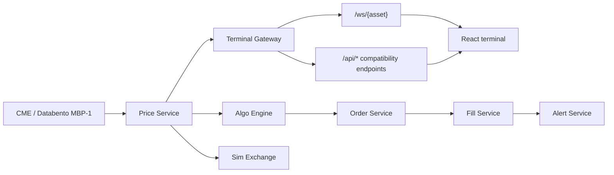

# Cerious Systems Architecture

## Direction

Cerious keeps the learned Acme terminal workflow while replacing the monolith with service boundaries.

## Current Local Mode

The gateway runs all services in one Python process for local development, but the code is organized by service boundary. That makes the first build easy to test from this machine and easier to split into cloud deployables later.

## Constraint

CME is the only live ingress in this build. Legacy venue providers are copied only as preserved domain/reference material or removed from active service wiring.

