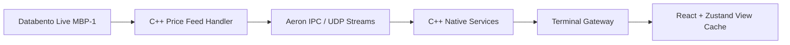

# Cerious Native Tauri + C++ + Aeron Plan

## Decision

Use Tauri for the desktop shell, keep React for the terminal UI, and move latency-sensitive backend services to native C++ behind stable service contracts.

Tauri is the desktop container, not the trading engine. The trading engine remains service-based.

## Source Review

- Tauri is appropriate for this UI because it can host the existing React/Vite terminal while using a Rust core process for OS integration, window orchestration, tray/menu support, notifications, process supervision, and secure IPC.
- Databento C++ is appropriate for the CME feed handler because the official client supports live streaming and historical data, requires C++17 and CMake 3.24, and exposes MBP-1 records through `Schema::Mbp1` / `Mbp1Msg`.
- Aeron is appropriate for backend/native event transport where we need predictable low-latency IPC, UDP unicast/multicast, and persistent replay through Aeron Archive.

## Aeron Does Not Replace Zustand

Zustand remains a UI-local cache and interaction state store.

Aeron belongs below the gateway:

The UI should never subscribe directly to Aeron in the first production build. The gateway owns client-facing WebSocket contracts, authentication, workspace state, and safety.

## Native Service Boundaries

### C++ Price Service

Responsibilities:

- Databento live MBP-1 ingress.
- Databento historical baseline requests for definitions, trades, and OHLCV.
- Product definition normalization.
- Top-of-book and last-trade event publication.
- Synthetic spread mark calculation after both legs are live.
- Sequence numbers and freshness metadata.

### C++ Order Service

Responsibilities:

- Canonical working order book.
- Manual and algo order intent acceptance.
- Cancel/replace.
- Kill all.
- Order lifecycle state.
- Event publication to depth ladders, order books, positions, fills, and audit trail.

### C++ Sim Exchange

Responsibilities:

- Treat simulation as an exchange adapter.
- Match against normalized price-service events.
- Publish fills.
- Update open positions.
- Mark PnL using product definition multipliers.

### C++ Studies Service

Responsibilities:

- Rolling OHLCV buffers.
- LR27 30-minute regression.
- ATR.
- Volume at price.
- Relative value / Goose / spread signals.
- Publish snapshots with bar timestamp, freshness, and input quality.

## Event Transport Strategy

Phase 1 uses a dev-safe publisher that writes normalized events to stdout or loopback for parity testing.

Phase 2 replaces the dev publisher with Aeron:

- `cerious.market.mbp1`
- `cerious.market.trade`
- `cerious.market.definition`
- `cerious.market.synthetic`
- `cerious.order.event`
- `cerious.fill.event`
- `cerious.position.snapshot`
- `cerious.study.snapshot`
- `cerious.audit.event`

Phase 3 adds Aeron Archive for deterministic session replay and post-trade audit.

## Tauri Desktop Strategy

The desktop shell should:

- Start or connect to local services.
- Show a native toolbar.
- Open saved desktop windows.
- Persist layout locally and server-side.
- Display service health.
- Provide kill-all access.
- Emit desktop/audio alerts.

The desktop shell should not:

- Own market-data interpretation.
- Own order lifecycle.
- Compute algo send prices.
- Bypass the gateway contracts.

## Migration Order

1. Keep the current UI operational while native services become the authoritative backend.
2. Add C++ Databento feed handler under `native/price-feed-cpp`.
3. Add C++ Databento historical backfill under `native/price-feed-cpp`.
4. Publish normalized quote/trade/definition/OHLCV events in a test harness.
5. Build parity tests against known-good market data, chart, and algo outputs.
6. Add Aeron publisher/subscriber adapters.
7. Add the native bridge/read model so the terminal consumes native events without owning trading state.
8. Bring Simulex online as the local simulation exchange.
9. Bring the native order service online.
10. Bring the native studies service online only after chart/algo parity is locked.
11. Add Tauri desktop shell.

## Toolchain Requirements

Native build toolchain:

- Microsoft Visual Studio Build Tools or equivalent C++17 compiler.
- CMake 3.24+.
- OpenSSL 3.
- zstd.
- Rust stable and Cargo for Tauri.

Do not switch the running terminal to native services until all parity tests pass.
